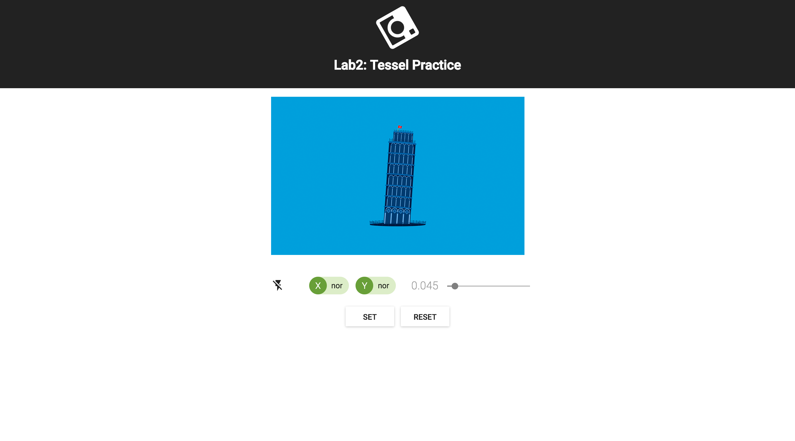

Digital Level
=========
  
This is a digital level built with Tessel 2, its accelerometer module and compatible webcam.

## Features

* Camera viewfinder
* Sensitivity tuning
* Set and reset calibration
* LED indicator
* LED flashlight

---

## Setup

#### Get the source code  

	git clone https://github.com/ESLab-2017/Lab2.git 
	cd Lab2
	
#### Download and install all the dependencies

	npm install
  
---
	
## Usage

#### Connect Tessel 2 and let it connect to wifi

	t2 list
	t2 wifi -n wifi_name -p wifi_password
	
#### Check the ip address of your Tessel 2

	t2 wifi
	
#### Change the url in client/src/App.js

#### Build the client-side web page

	yarn run build
	yarn run move
	
#### Plug in accelerometer and camera modules

#### Start server

	npm start

#### Open a browser and go to 

	localhost:3000
	
#### Start leveling!

---

## Built With

* [Tessel 2](https://tessel.io/) - A robust IoT and robotics development platform.
* [React](https://facebook.github.io/react/) - A Javascript libray for building user interface.
* [Express](http://expressjs.com/) - Web framwork for Node.js.
* [socket.io](https://socket.io/) - Enables real-time bidirectional event-based communication.

---

## Team

 | 
---|---
[Kuan Tung](https://github.com/dtk0528) | [Mike Lee](https://github.com/mike8411251995)
